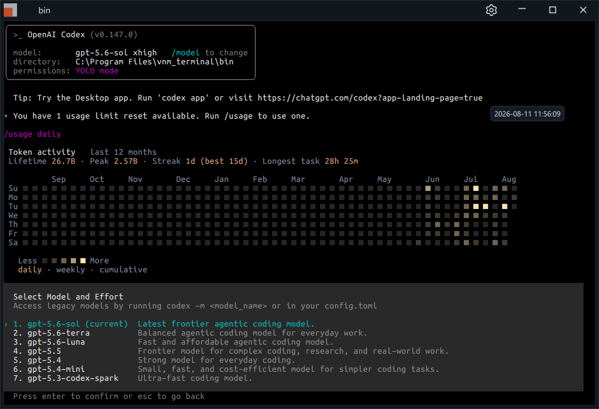
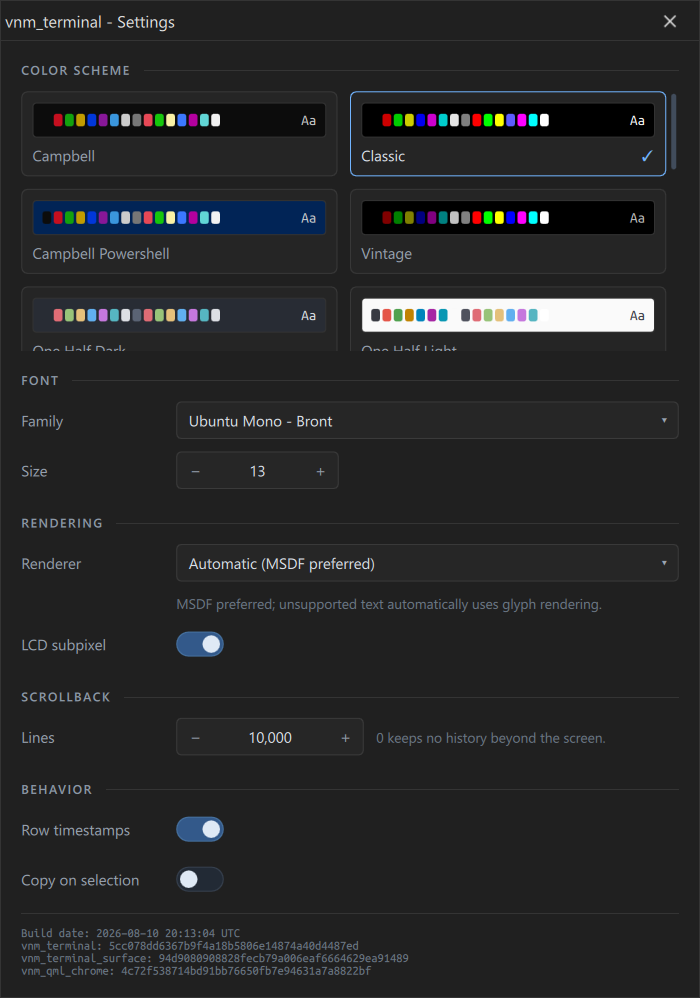

# vnm_terminal

[](https://github.com/Varinomics/vnm_terminal/actions/workflows/ci-linux.yml) [](https://github.com/Varinomics/vnm_terminal/actions/workflows/ci-windows.yml) [](https://github.com/Varinomics/vnm_terminal/actions/workflows/ci-macos.yml)

> **Latest release:** [Windows installer and other platform downloads](https://github.com/Varinomics/vnm_terminal/releases/latest)
>
> The primary Windows package is
> `vnm_terminal_v<version>_windows_x64.exe`.

`vnm_terminal` is a focused, single-session terminal emulator for Windows,
macOS, and Linux. Each window hosts the platform's default shell or one explicit
command. Tabs, splits, and connection management are outside the application's
scope.

The application is built on
[`vnm_terminal_surface`](https://github.com/Varinomics/vnm_terminal_surface),
which owns terminal parsing, ConPTY/PTY process hosting, screen state, and
GPU-accelerated rendering.



*An interactive child process with a row-change timestamp at the right.*

## Highlights

- Native ConPTY/PTY hosting with alternate-screen applications, keyboard and
  mouse reporting, bracketed paste, selection, and IME input.
- GPU glyph-atlas text rendering with automatic MSDF and glyph-renderer
  selection, including LCD subpixel modes.
- Reproducible terminal-cell widths based on an owned
  [Unicode 16.0 policy](https://github.com/Varinomics/vnm_terminal_surface/blob/master/docs/unicode_width_policy.md).
- Built-in window chrome, color schemes, font controls, scrollback settings,
  and persisted appearance and window configuration.
- Retained-output search with result navigation and synchronized-output-safe
  publication semantics.
- Explicit OSC 8 hyperlink interaction with host-side HTTP, HTTPS, and mailto
  scheme validation.
- Safe clipboard defaults: terminal-originated OSC 52 writes remain denied
  unless the application policy explicitly allows them.

<p align="center">
  
</p>

<p align="center"><em>Built-in appearance and behavior settings.</em></p>

## Release packages

All published packages are available from the
[latest release](https://github.com/Varinomics/vnm_terminal/releases/latest).

| Platform | Packages | Notes |
| --- | --- | --- |
| Windows x64 | EXE, portable ZIP | The signed Qt Installer Framework EXE installs under `Program Files` and includes Start Menu integration. The portable ZIP contains a top-level launcher. |
| Linux x64 | RUN, DEB, RPM, AppImage | The graphical RUN installer uses Qt Installer Framework. DEB and RPM integrate with native package managers; AppImage is the portable option. |
| macOS x64 | Application ZIP | The application bundle is ad-hoc signed but not Apple-notarized. Gatekeeper may quarantine it on first launch. |

Windows and Linux packages include their private Qt runtime. Release source
archives are available on the same page.

The Linux Qt Installer Framework package installs under `/opt/vnm_terminal`,
adds the `vnm_terminal` command under `/usr/local/bin`, and registers a desktop
launcher. Run its installed `vnm_terminal_maintenance` tool to uninstall it.
Build it from a staged CMake install tree with:

```bash
tools/build_linux_ifw_installer.sh \
  --payload AppDir \
  --ifw-root /path/to/QtInstallerFramework/4.7
```

Cutting a release starts with refreshing the dependency lock. The procedure, and
the facts the release declarations deliberately do not own, are in
[docs/releasing.md](docs/releasing.md).

Windows CI produces an explicitly named
`vnm_terminal_v<version>_windows_x64_unsigned.exe` verification artifact. It is
not a release installer. A release EXE has the `_unsigned` suffix removed only
after the payload, maintenance tool, and final installer have been
successfully signed as Varinomics Ltd and timestamped.

## Interaction

| Action | Default interaction |
| --- | --- |
| Search | `Ctrl+F` (`Cmd+F` on macOS) opens the search overlay. `Enter` or `F3` advances; the corresponding Shift chord selects the previous result. |
| Explicit hyperlink | `Ctrl+left-click` requests activation. Only absolute HTTP, HTTPS, and mailto targets are dispatched. |
| Paste | `Ctrl+V` and `Ctrl+Shift+V`; the exact policy is configurable. |
| Copy on selection | Disabled by default and available under **Settings > Behavior**. |
| Custom window title | Alt+left-click the built-in titlebar, edit the title, then press `Enter` or click elsewhere. |
| Native titlebar | Available through `--native-titlebar`; built-in chrome is the validated default. |

## Command line

Without an explicit command after `--`, the platform's default shell starts.

```text
vnm_terminal [application options] [-- command [arguments...]]
```

Common application options:

| Option | Values | Purpose |
| --- | --- | --- |
| `--window-size` | `<width>x<height>` | Initial window dimensions. |
| `--native-titlebar` | — | Platform-provided window frame. |
| `--text-renderer` | `auto`, `msdf`, `glyph` | Terminal text-renderer policy. |
| `--lcd-subpixel` | `auto`, `none`, `rgb`, `bgr`, `vrgb`, `vbgr` | MSDF LCD sampling policy. |
| `--paste-shortcut` | `<mode>` | Configurable paste-shortcut policy. |
| `--synchronized-output-scroll-policy` | `defer`, `immediate-public` | Scroll behavior during DEC synchronized output. |

Example:

```powershell
.\build\Release\vnm_terminal.exe --window-size 1000x640 -- cmd.exe
```

## Source build

The release dependency layout places `vnm_terminal_surface` and
`vnm_qml_chrome` beside this repository. Custom locations are supported through
`VNM_TERMINAL_SURFACE_SOURCE_DIR` and `VNM_QML_CHROME_SOURCE_DIR`.

`vnm_terminal_surface` requires the same `project()` version as the
application. `vnm_qml_chrome` requires the same major version and at least the
1.7 default PID-reveal titlebar contract. The validated Qt baseline is Qt 6.11.1
or newer.

```powershell
cmake -S . -B build -DBUILD_TESTING=ON
cmake --build build --config Release
ctest --test-dir build -C Release --output-on-failure
```

Automated runs must not write the user's persisted settings. Defining
`VNM_TERMINAL_SETTINGS_NO_PERSIST` disables window and appearance persistence
for the process. The check is on the variable being defined, not on its value:
any value disables persistence, including `0` and the empty string. Re-enable
persistence by removing the variable from the environment. The offscreen Qt
platform disables persistence as well, and the test registrations define the
variable themselves.

The Windows build target deploys the required Qt DLLs and `platforms` plugin
beside `vnm_terminal.exe`. The executable and its deployed runtime form one
launchable build artifact.

Transcript capture/replay is excluded from normal builds. Local diagnostic
builds expose it through
`-DVNM_TERMINAL_ENABLE_TRANSCRIPT_CAPTURE_REPLAY=ON`; distribution builds use
`-DVNM_TERMINAL_DISTRIBUTION_BUILD=ON` and reject transcript capture.

## License

GNU General Public License version 3 only. [LICENSE](LICENSE) contains the full
license text.
